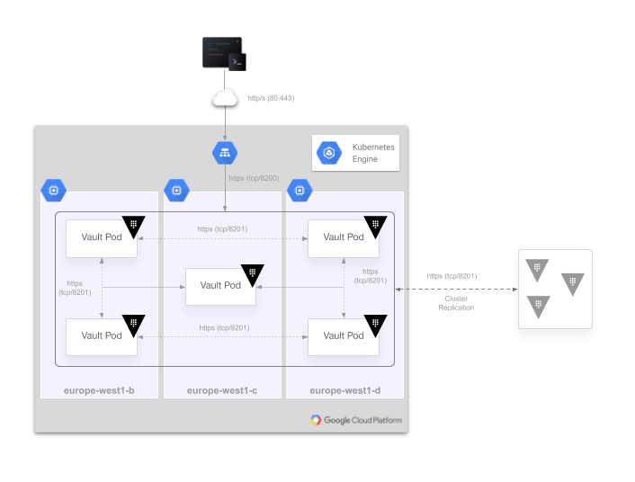
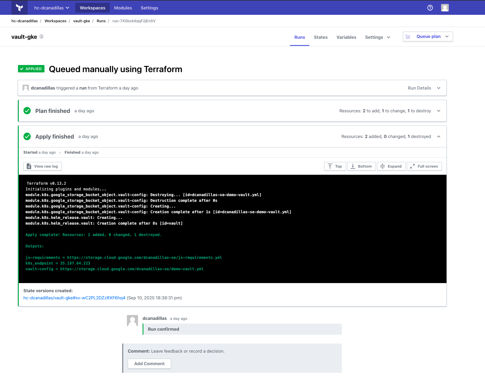
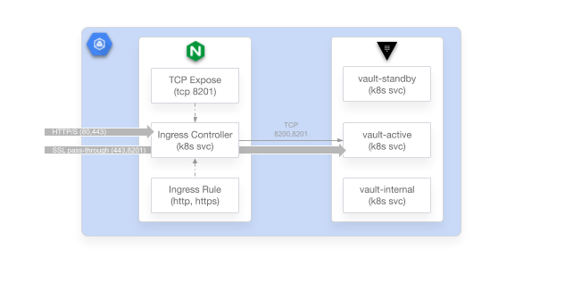

# HashiCorp Vault Enterprise Deployment on GKE with Raft Storage Backend and NGINX Ingress Controller

> DISCLOSURE: This repo is not an official HashiCorp repository and **it's still a work in progress**

The repository is structured to deploy HashiCorp Vault on Google Container Engine (GKE) with a [Raft Storage Backend](https://www.vaultproject.io/docs/configuration/storage/raft) for HA. The workflow used to provision the infrastructure is described below:
1. Create a GKE cluster on GCP creating its network and subnetwork. You can specify creating a non-default  node pool (it takes longer in that case)
2. Generate a Cloud Crypto Key in Cloud KMS for [Google KMS for Vault auto-unsealing](https://www.vaultproject.io/docs/configuration/seal/gcpckms)
3. Create some Kubernetes resources required, like Kubernetes namespaces or Kubernetes secrets (one for TLS certificates and other for the credentials to integrate with Google KMS auto-unsealing )
4. Dinamycally create - based on the provided parameters - the Vault `values.yaml` to [deploy using Vault Helm Chart](https://www.vaultproject.io/docs/platform/k8s/helm), and store the file in a Google Cloud Storage bucket, so you can reuse it for later manual upgrades with Helm (`helm upgrade vault hashicorp/vault -f gs://your_vault_values.yaml`)
5. Deploy [Kubernetes NGINX Ingress controller](https://kubernetes.github.io/ingress-nginx/) using Helm, exposing the `8201 TCP` port in the Load Balancer in the case you want to do Vault cluster replication within different Kubernetes clusters, and configuring SSL passthrough in the ingress controller to be able to do End-To-End TLS authentication
6. Deploy Vault in HA mode with Raft Storage Backed using Helm with the previous generated `values YAML file` 


Workflow is represented in the following diagram:

.png)

## Structure of this repo

You will find in this repo a Terraform configuration structure:
* Terraform configuration files `.tf` 
* Terraform modules paths
* Template files with Vault GKE deployment configuration

The folder structure of the content repo is as follows:
```
vault-gke (root path with *.tf files and main resources )
|__ images (Folder with images for this `README` doc)
|__ modules (Terraform modules folder)
    |__ gke (Module that creates GKE cluster)
    |__ kubernetes (Module to deploy Vault and resources in K8s)
|__ templates (file templates dinamycally generated by Terraform)
```

## Architecture to be deployed
The Terraform configuration of this repo will deploy a Vault cluster in GKE Kubernetes platform, using HA mode with Raft Integrated Storage backend. It will create the K8s cluster with the specific number of nodes (default is 3) and it will deploy Vault using the official HashiCorp Helm Chart. The architecture diagram is described below (example of 3 node K8s cluster with 5 Vault nodes with a regional cluster):



There are some important considerations in this deployment (there are some details at the end of this `README`):

* A common recommended approach is using a L4 Load Balancer to access Vault cluster, which is possible by configuring the `vault-active` service as `type: LoadBalancer`. A different approach is to **use  an ingress controller, which is the default configuration shown in this repo**, but considering the following:
  
  * End-To-End TLS need to be enabled by `ssl-passthrough` in the ingress rule
  * `8201` need to be exposed to enable replication capabitlies for Vault clusters

* When using the NGINX Kubernetes Ingress Controller the connection is proxied to Vault service `vaut-active` to access the Vault API and UI, using `ssl-passthrough` to do End-To-End TLS (check [the Vault Production Hardening guide](https://learn.hashicorp.com/tutorials/vault/kubernetes-security-concerns#end-to-end-tls)):
  
  ```
   80 >------> 8200
  443 >------> 8200
  ```
  
  
* Port 8201 is also exposed to enable [Performance or Disaster Recovery replication](https://www.vaultproject.io/docs/internals/replication) between Vault clusters, but using L4 TCP connection . The TLS authentication in this case is using own CA signed certificates from Vault, so this connection need to be End-To-End as well.

  ```
  8201 >------> 8201
  ```


## Requirements
You will need Terraform and a Google Cloud Platform account to deploy the infrastructure defined in this repo:

* [Download Terraform CLI](https://www.terraform.io/downloads.html) 
* Configure a Service Account with GCP permissions (you can use a [Google Cloud Free Tier](https://cloud.google.com/free) if you didn't do it before or cannot have access to GCP)to create and manage :
  * GKE clusters and resources
  * Google Cloud Storage
  * Google Cloud KMS


### Configure GCP Service Account credentials and environment variables
You can do it in the [Google Cloud Console](https://console.cloud.google.com/) or using `gcloud` cli. In this case it would be something similar to ().

- Create a service account
  ```bash
  gcloud iam service-account create <your_service_account_name> --display-name=<your_service_account_name>
  ```
- List the service account, so you can check the email id (name@project.iam.serviceaccount.com)
  ```bash
  gcloud iam service-accounts list --filter=NAME=<your_service_account_name>
  ```
- Copy the previous service account email id and add the specific roles (this example assumes you can admin most of them):
  ```bash
  gcloud projects add-iam-policy-binding <gcp_project> \
  --member=serviceAccount:<your_service_account_email_id> \
  --role roles/container.admin \
  --role roles/container.clusterAdmin \
  --role roles/kms.admin \
  --role roles/compute.admin \
  --role roles/networkmanagement.admin \
  --role roles/storage.objectAdmin
  ```
- Create an account key (a json file `credentials.json` should be dowloaded):
  ```bash
  gcloud iam service-accounts keys create credentials.json \
  --iam-account <your_service_account_email_id>
  ```
- Export your environment variable `GOOGLE_APPLICATIONS_CREDENTIALS` with the recent file downloaded
  ```bash
  export GOOGLE_APPLICATIONS_CREDENTIALS="./credentials.json"
  ```

## Terraform configuration with Terraform Cloud

You can use either your local execution of Terraform or using [Terraform Cloud/Terraform Enterprise](https://app.terraform.io/) (TFC/TFE) as backends. You can [sign up for a free account](https://app.terraform.io/signup/account).

This repo has been tested using Terraform Cloud (TFC) as a remote backend, but it should work also using [your own backend](https://www.terraform.io/docs/backends/types/index.html). To use TFC/TFE you can specify the backend data in a `backend.hcl` on the root path of this repo (you can select a different path, but then you need to be sure to specify the absolute path when initializing the backend):

```
workspaces { name = "<my_workspace>" }
hostname     = "app.terraform.io"
organization = "<my_org>"
```

And then initialize your Terraform with the backend configuration (remember to be on the root path of this repo):

```bash
terraform init -backend-config=backend.hcl
```

And last, and very important, configure your [workspace variables](https://www.terraform.io/docs/cloud/workspaces/variables.html) with your desired values. This is the list of required variables:
- Environment variables:
    * `GOOGLE_CREDENTIALS` (as sensitive value)
- Terraform variables:
    * `gcp_region`	-- The GCP region to deploy
    * `gcp_project`  -- GCP project scope to be used
    * `node_type` -- The size of the VM for the nodes (e.g. `n2-standard-2`)
    * `gcp_zone` -- GCP zone if using a zonal cluster
    * `gke_cluster` -- Name of the K8s cluster to be created
    * `numnodes` -- Number of VM nodes for the K8s cluster
    * `vault_nodes` -- Number of vault servers (pods) in HA mode
    * `vault_hostname` -- FQDN of your Vault cluster
    * `regional_k8s` *(check the `HCL` option)* -- True/False for a regional K8s cluster
    * `owner` -- An owner name to be tagged
    * `gcs_bucket` -- GCS bucket to store `yaml` templates
    * `key_ring` -- Google KMS Keyring name
    * `crypto_key` -- A prefix for the key name in KMS
    * `service_account` -- A service account name to be used for the KMS credentials
    * `default_gke` *(check the `HCL` option)* -- True/False if you want to use a `default` node pool for GKE
    * `vault_cert` -- The Vault certificate to be used for TLS
    * `vault_ca`  -- Vault CA certificate used for signing the Vault certificate
    * `vault_key` *(check the `sensitive` option)* -- The Vault key of the certificate
    * `tls` -- enabled/disabled to enable TLS and use HTTPS (you need to provide de certificates if you enable it)

### Uploading your variables to TFE/TFC
You can also upload any variable with a POST Rest API request:
1. Create a JSON payload file `payload.json` with the variable data (example below of the `gcp_region` variable):
   ```bash
   {
    "data": {
        "type":"vars",
        "attributes": {
            "key":"gcp_region",
            "value":"europe-west1-c",
            "description":"GCP Region for the cluster",
            "category":"terraform",
            "hcl":false,
            "sensitive":false
            }
        }
    }
   ```
   
2. Store your TFC token in an environment variable

    ```
   export TFE_TOKEN=<your_TFC_token>
    ```

3. Get your `workspace id`, either by API request or by [TFC/TFE console](https://app.terraform.io). Using `curl` and `jq` (parse and filter JSON response) would be:
   ```bash
   curl -H "Authorization: Bearer $TFE_TOKEN" -H "Content-Type: application/vnd.api+json" \
   -X GET \
   -s "https://app.terraform.io/api/v2/organizations/<your_organization>/workspaces/<your_workspace_name>" \
   | jq -r '.data.id'
   ```

4. Create the remote variable with `curl` (or by other HTTP API request tool or library) using the previous `workspace id`:
   ```bash
   curl -H "Authorization: Bearer $TFE_TOKEN" -H "Content-Type: application/vnd.api+json" \
   -X POST \
   -d @payload.json \
   https://app.terraform.io/api/v2/workspaces/<your_workspace_id>/vars
   ```

> * I developed a [dumb Python wrapper](https://github.com/dcanadillas/tfc-python) where you can upload them *in a batch way* to make this task less painful. It is still under development, but uploading vars is an easy task.
> * You can also use the [Terraform provider]() from a Terraform configuration to upload variable configurations to TFE/TFC
> * Or using a traditional way of defining variables in a `*.auto.tfvars` file


### Using local Terraform backend

If you still want to use a common Terraform OSS local backend:

1. Edit the `main.tf` and change the block `backend "remote" {}`, so you will have something like:

   ```
   terraform {
     required_version = ">= 0.12.26"
     backend "local" {}
   }
   ```
2. Create your `terraform.auto.tfvars` file with all variable values described previously:

   ```
   gcp_region = "<your_gcp_region>"
   gcp_project = "<your_gcp_project>"
   gke_cluster = "<desired_k8s_cluster_name>"
   ...
   ...
   ```

3. Initialize your Terraform locally:

   ```bash
   terraform init
   ```

## Deploying Vault infra with Terraform

Once you have your Terraform Workspace ready (created and variables uploaded/set) you can :

```bash
terraform apply
```

Check that the resources to be created in the Plan are the right ones and type `yes`.

You can check the ouput of the your terminal execution, or you can check also the run on the [Terraform UI](https://app.terraform.io) (TFE/TFC) :




## Generated configuration and some extra considerations

Vault is deployed using the official HashiCorp Helm Chart. It generate a Kubernetes `StatefulSet` application with its   `Services`, `ConfigMaps`, `Pods`, `Secrets`, etc... that will be created depending on the parameter values set during `helm install`. 

Here is an example of a `vault.yaml` YAML values file created during the Terraform deployment (some of the data is masked for extra security/privacy reasons):

```yaml
global:
  enabled: true
  tlsDisable: false
injector:
  # True if you want to enable vault agent injection.
  enabled: false
server:
  image:
    repository: "hashicorp/vault-enterprise"
    tag: "1.5.2_ent"
    pullPolicy: IfNotPresent
  updateStrategyType: "OnDelete"

  ingress:
    enabled: true
    annotations:
      kubernetes.io/ingress.class: nginx
    #   # kubernetes.io/tls-acme: "true"
      nginx.ingress.kubernetes.io/backend-protocol: HTTPS
      nginx.ingress.kubernetes.io/ssl-passthrough: "true"
      nginx.ingress.kubernetes.io/ssl-redirect: "true"
    hosts:
      - host: "vault.dcanadillas.com"
        paths: []
    tls: []
    #  - secretName: chart-example-tls
    #    hosts:
    #      - chart-example.local

  readinessProbe:
    # ready if unsealed, either active or standby or performancestandby
    enabled: true
    path: /v1/sys/health?standbycode=204&performancestandbycode=204&drsecondarycode=204

  livenessProbe:
    # alive if vault is successfully responding to requests
    enabled: true
    path: /v1/sys/health?standbyok=true&perfstandbyok=true&sealedcode=204&uninitcode=204&drsecondarycode=204
    initialDelaySeconds: 30

  postStart: []
  # - /bin/sh
  # - -c
  # - /vault/userconfig/myscript/run.sh

  extraEnvironmentVars:
    GOOGLE_REGION: "europe-west1"
    GOOGLE_PROJECT: "**********"
    GOOGLE_APPLICATION_CREDENTIALS: "/vault/userconfig/kms-creds/credentials.json"
    VAULT_CACERT: /vault/userconfig/vault-server-tls/vault.ca

  # extraVolumes is a list of extra volumes to mount. These will be exposed
  # to Vault in the path `/vault/userconfig/<name>/`. The value below is
  # an array of objects, examples are shown below.
  extraVolumes:
    - type: 'secret'
      name: 'kms-creds'
    - type: 'secret'
      name: 'vault-server-tls'

  affinity: |
    podAntiAffinity:
      requiredDuringSchedulingIgnoredDuringExecution:
        - labelSelector:
            matchLabels:
              app.kubernetes.io/name: {{ template "vault.name" . }}
              app.kubernetes.io/instance: "{{ .Release.Name }}"
              component: server
          topologyKey: kubernetes.io/hostname

  # Enables a headless service to be used by the Vault Statefulset
  service:
    enabled: true
    # clusterIP: None
    type: "NodePort"
    # nodePort: 30000
    # port: 8200
    # targetPort: 8200
    # annotations: {}

  # dataStorage:
  #   enabled: true
  #   # Size of the PVC created
  #   size: 10Gi
  #   storageClass: null
  #   accessMode: ReadWriteOnce

  # auditStorage:
  #   enabled: false
  #   # Size of the PVC created
  #   size: 10Gi
  #   storageClass: null
  #   accessMode: ReadWriteOnce

  ha:
    enabled: true
    replicas: 3

    # If set to null, this will be set to the Pod IP Address
    apiAddr: null

    raft:
      enabled: true
      setNodeId: true
      config: |
        ui = true
        listener "tcp" {
          tls_disable = 0
          address = "[::]:8200"
          cluster_address = "[::]:8201"
          tls_cert_file = "/vault/userconfig/vault-server-tls/vault.crt"
          tls_key_file = "/vault/userconfig/vault-server-tls/vault.key"
          tls_ca_cert_file = "/vault/userconfig/vault-server-tls/vault.ca"
        }
        storage "raft" {
          path = "/vault/data"
          retry_join {
            leader_api_addr = "https://vault-0.vault-internal:8200"
            leader_ca_cert_file = "/vault/userconfig/vault-server-tls/vault.ca"
            leader_client_cert_file = "/vault/userconfig/vault-server-tls/vault.crt"
            leader_client_key_file = "/vault/userconfig/vault-server-tls/vault.key"
          }
          retry_join {
            leader_api_addr = "https://vault-1.vault-internal:8200"
            leader_ca_cert_file = "/vault/userconfig/vault-server-tls/vault.ca"
            leader_client_cert_file = "/vault/userconfig/vault-server-tls/vault.crt"
            leader_client_key_file = "/vault/userconfig/vault-server-tls/vault.key"
          }
          retry_join {
            leader_api_addr = "https://vault-2.vault-internal:8200"
            leader_ca_cert_file = "/vault/userconfig/vault-server-tls/vault.ca"
            leader_client_cert_file = "/vault/userconfig/vault-server-tls/vault.crt"
            leader_client_key_file = "/vault/userconfig/vault-server-tls/vault.key"
          }
        }
        service_registration "kubernetes" {}
        # Using GCP KMP
        seal "gcpckms" {
          project     = "*********"
          region      = "europe-west1"
          key_ring    = "*********"
          crypto_key  = "vault-key-16480855059169"
        }

# Vault UI
ui:
  enabled: false
  serviceType: "LoadBalancer"
  # serviceNodePort: null
  externalPort: 8200
```


### Kubernetes NGINX Ingress Controller Configuration

The ingress controller is a moving piece that can introduce some complexity regarding the ` ssl-passthrough` configuration that we are proposing for End-To-End TLS and replication clusters in Vault.

When Vault is deployed in HA mode, like the Raft Storage backend configuration, it creates several Kubernetes `Services` for different purposes:

* `vault-active` -- This service points to the active server (`Pod`) based on a label selector that is automatically registered by Vault config when using the `service_registration` stanza. It exposes the 8200 and 8201 ports for API and log replication or forward requests.
* `vault-standby` -- Points to the other `standby` servers of the cluster by its selector
* `vault-internal` -- Internal service that points to every vault server type for internal traffic between servers, like server node forward requests.
* `vault` -- Service that points to every started Vault server and can load balance between active or standby nodes if necessary. This is the service that is the default one when HA is not configured

If enabling the `ui` global configuration in the Helm Chart values, another `vault-ui` service is deployed in the K8s cluster. This is only needed in case of isolating the UI and API connection (8200 by default) in a different service that can be load balanced.

So, when the ingress controller is configured and the ingress rule created, it will forward the request to the `vault-active` service. Because the ingress proxy is only listening by default on the 80 and 443 port, the ingress rule specifies the connection to the 8200 port of the downstream servers.

Also, as mentioned in the architecture, the 8201 port needs to be exposed to make possible the connection of the cluster replication features of Vault Enterprise.



To avoid TLS termination at the controller, we need to enable an extra startup argument to do `ssl-passthrough`. This is a configuration that is defined in the Kubernetes `Deployment` object to start the container in the specific pod. 

Also,  we need to tell the NGINX server to expose the TCP connection in the port 8201. This is done by defining a [specific `ConfigMap` ](https://kubernetes.github.io/ingress-nginx/user-guide/exposing-tcp-udp-services/) with the configuration that is passed to the ingress controller. It is required then that the parameter `--tcp-services-configmap` is set with the `ConfigMap` path.

This configuration definition to deploy the Kubernetes NGINX Ingress is in an `ngingx_values.yaml` like this one:

```yaml
fullnameOverride: "vault-nginx"
rbac:
  create: true
controller:
  name: "vault-nginx"
  ingressClass: "nginx"
  extraArgs:
    enable-ssl-passthrough: true
service:
  externalTrafficPolicy: "Local"
tcp:
  8201: "vault-cluster/vault-active:8201"
```

So, you could deploy with 

```bash
helm install ingress ingress-nginx/ingress-nginx -f nginx_values.yaml`
```

The ingress rule created for Vault is something like the following YAML file:

```yaml
apiVersion extensions/v1beta1
kind: Ingress
metadata:
  annotations:
    kubernetes.io/ingress.class: nginx
    meta.helm.sh/release-name: vault
    meta.helm.sh/release-namespace: vault-cluster
    nginx.ingress.kubernetes.io/backend-protocol: HTTPS
    nginx.ingress.kubernetes.io/ssl-passthrough: "true"
    nginx.ingress.kubernetes.io/ssl-redirect: "true"
  labels:
    app.kubernetes.io/instance: vault
    app.kubernetes.io/managed-by: Helm
    app.kubernetes.io/name: vault
    helm.sh/chart: vault-0.7.0
  name: vault
  namespace: vault-cluster
spec:
  rules:
  - host: "vault.dcanadillas.com"
    http:
      paths:
      - backend:
          serviceName: vault-active
          servicePort: 8200
        path: /
```

You need to be aware about the following important considerations:

* `backend-protocol` annotation needs to be set to `HTTPS` to make the `ssl-passthrough` working, that is also configured as an annotation in the ingress rule
* The `.spec.host` needs to be a FQDN. If you use any wildcard, like `*` or `*.mydomain.com` , SSL passthrough won't work 
* The `ssl-redirect` annotation can be also a little bit "tricky", so you may need to define a `force-ssl-redirect` annotation
* You may experience problems if you try to configure "sub-pathing" in the ingress rule, so I don't recommend it at all

All these annotations are set in the Vault `values.yaml` definition when deploying Vault:

```yaml
 ...
 ingress:
    enabled: true
    annotations:
      kubernetes.io/ingress.class: nginx
      nginx.ingress.kubernetes.io/backend-protocol: HTTPS
      nginx.ingress.kubernetes.io/ssl-passthrough: "true"
      nginx.ingress.kubernetes.io/ssl-redirect: "true"
    hosts:
      - host: "vault.dcanadillas.com"
        paths:
          - /
 ...
```


## Final thoughts if you use this Terraform configuration

After spending hours on this, one of the reasons to configure an NGINX Ingress Controller to expose Vault cluster to the outside world is that it is something that could be required on specific networks or configurations (not only for technical reasons). The challenge is about to configure everything that can fit into the Production Hardening recommendations for Vault while being able to adapt to some specific network setups.

This Terraform configuration is going to help in automating the process, even if you use NGINX Ingress or not. But it is also designed to easily modify the modules or parameters in the case you need to change it. So, feel free to clone it, fork it, change it, and use it for your own good :-)  

It is also important to consider some thoughts:

* If you can do L4 Load Balancing in GKE setup... don't even think about any other option. It is as easy as configuring the Vault Kubernetes services as `type: LoadBalancer`
* If you need to integrate Vault architecture in a Service Mesh environment, think about [Consul](https://www.consul.io/) or refer to the [Kubernetes reference guide](https://learn.hashicorp.com/tutorials/vault/kubernetes-reference-architecture?in=vault/kubernetes)
* You can use other L7 options, Ingress Controllers or Service Mesh solutions, but the complexity here is about to understand what SSL passthrough configurations and L4 recommendations are taking in place, and how to configure all moving pieces depending on your Kubernetes networking solution to maintain Security adoption


## ToDo's and caveats...

There are already some easy tasks to do or to resolve.. but it requires time

- Improve TLS configuration parametrization in the Terraform (some issues are already identified if not using TLS in the ingress)
- Include the option of auto-generate TLS certs with Terraform (it wasn't included previously on purpose, but it could make sense to have it for testing purposes)
- Make NGINX Ingress installation and configuration as optional, not y default
- Include the option of creating the GCS bucket in the Terraform. Right now you have to specify an existing one.
- ....

